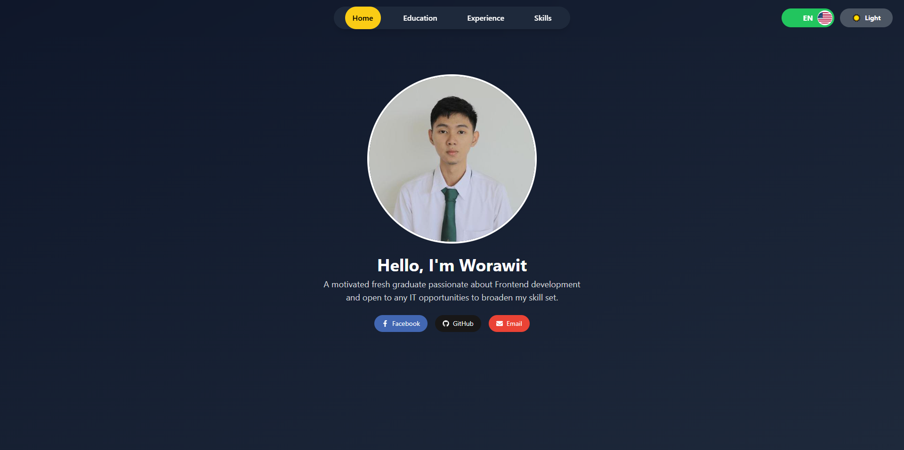

# 🖥️ Nantasu Site

A modern frontend web project powered by **React.js**, **TailwindCSS**, and **Vite.js**.  
Designed to be lightweight, responsive, and scalable for personal or professional portfolio websites.

---

## 🚀 Tech Stack

- **React.js** — Frontend JavaScript library
- **TailwindCSS** — Utility-first CSS framework
- **Vite** — Blazing-fast frontend build tool
- **ESLint** — Code quality enforcement

---

## 📂 Folder Structure

```
nantasu-site/
├── public/                  # Static assets
│   └── screenshot-homepage.png  # Project screenshot
├── src/                     # Source code
│   ├── assets/              # Images and static media
│   ├── components/          # Reusable React components
│   ├── sections/            # Page sections (Home, About, Skills, etc.)
│   ├── App.jsx              # Main App Component
│   └── main.jsx             # ReactDOM entry point
├── index.html               # HTML template
├── tailwind.config.js       # TailwindCSS configuration
├── postcss.config.js        # PostCSS configuration
├── package.json             # Project metadata and dependencies
└── README.md                # Project description (this file)
```

---

## 🛠️ Getting Started

### 1. Clone the Repository
```bash
git clone https://github.com/Worawit-Nantasu/nantasu-site.git
cd nantasu-site
```

### 2. Install Dependencies
```bash
npm install
```

### 3. Setup TailwindCSS (if necessary)
> If TailwindCSS doesn't work correctly (e.g., background colors missing), run:
```bash
npm install -D tailwindcss postcss autoprefixer
npx tailwindcss init -p
```

### 4. Start the Development Server
```bash
npm run dev
```
> By default: Open [http://localhost:5173](http://localhost:5173) to view it in your browser.

---

# 🙌 Special Thanks

Created by **Worawit Nantasu** with ❤️ and passion for modern web development.

---

# 📸 Project Screenshot

### Home Page

